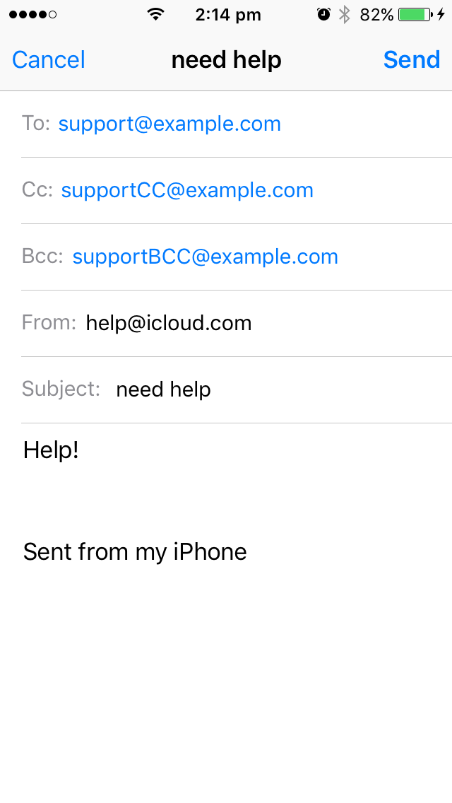

# react-native-mail

A React Native wrapper for Apple's ``MFMailComposeViewController`` from iOS and
Mail Intent on Android

Supports emails with attachments.

### Installation

There was a breaking change in RN >=40. So for React Native >= 0.40: use v3.x
and higher of this lib. otherwise use v2.x

For React Native >= 0.40:

```bash
npm install --save react-native-mail
```

For React Native < 0.40:

```bash
npm install --save react-native-mail@2
```

To automagically link to your project:

```bash
react-native link react-native-mail
```

### Add it manually to your Android project

* In `android/setting.gradle`

```gradle
...
include ':RNMail', ':app'
project(':RNMail').projectDir = new File(rootProject.projectDir, '../node_modules/react-native-mail/android')
```

* In `android/app/build.gradle`

```gradle
...
dependencies {
    ...
    compile project(':RNMail')
}
```

* if MainActivity extends Activity - register module in MainActivity.java


```java
import com.chirag.RNMail.*;  // <--- import

public class MainActivity extends Activity implements DefaultHardwareBackBtnHandler {
  ......

  @Override
  protected void onCreate(Bundle savedInstanceState) {
    super.onCreate(savedInstanceState);
    mReactRootView = new ReactRootView(this);

    mReactInstanceManager = ReactInstanceManager.builder()
      .setApplication(getApplication())
      .setBundleAssetName("index.android.bundle")
      .setJSMainModuleName("index.android")
      .addPackage(new MainReactPackage())
      .addPackage(new RNMail())              // <------ add here
      ......
      .setUseDeveloperSupport(BuildConfig.DEBUG)
      .setInitialLifecycleState(LifecycleState.RESUMED)
      .build();

    mReactRootView.startReactApplication(mReactInstanceManager, "ExampleRN", null);

    setContentView(mReactRootView);
  }

  ......

}
```
* register module if MainActivity extends ReactActivity

* In `MainApplication.java`

```java
import com.chirag.RNMail.*; // <--- import

public class MainApplication extends Application implements ReactApplication {
    ....
  
    @Override
    protected List<ReactPackage> getPackages() {
      return Arrays.<ReactPackage>asList(
          new MainReactPackage(),
          new RNMail()      // <------ add here
          ....
      );
    }
  };

```


### Add it manually to your iOS project

1. Open your project in XCode, right click on `Libraries` and click `Add
   Files to "Your Project Name"`
   <a href="screenshots/add-xcodeproj-1.png">Screenshot</a>
   then navigate to `node_modules/react-native-mail` and select RNMail.xcodeproj
   <a href="screenshots/add-xcodeproj-2.png">Screeenshot</a>.
2. Add `libRNMail.a` to `Build Phases -> Link Binary With Libraries`
   <a href="screenshots/add-xcodeproj-3.png">Screenshot</a>.
3. Whenever you want to use it within React code now you can:

```javascript
import { NativeModules } from 'react-native';
const { RNMail } = NativeModules;

// or using require():
var RNMail = require('NativeModules').RNMail;
```


## Example

```javascript
/**
 * Sample React Native App using RNMail
 * @flow
 */

import React, { Component } from 'react';

import {
  AppRegistry,
  StyleSheet,
  Text,
  View,
  TouchableHighlight,
  NativeModules,
  Alert,
  Platform
} from 'react-native';

const { RNMail } = NativeModules;

const _sendMail = () => {
  RNMail.mail({
    recipients: ['support@example.com'],
    ccRecipients: ['supportCC@example.com'],
    bccRecipients: ['supportBCC@example.com'],
    //isHTML: true, // iOS only, exclude if false
    //attachment: {
    //  path: '', // The absolute path of the file from which to read data.
    //  type: '', // Mime Type: jpg, png, doc, ppt, html, pdf
    //  name: '', // Optional: Custom filename for attachment
    //},
    subject: 'need help',
    body: 'Help!'
  }, (error, event) => {
    if (error === 'not_available') {
      const message = Platform.OS === 'ios' ?
        'There is no email account registered with the system.' :
        'There is no email app to handle emails.';
      return Alert.alert('Error', message);
    }

    if (error) {
      return Alert.alert('Error', 'Could not send mail. Please send an email manually to support@example.com');
    }

    // NOTE: Android implementation doesn't send any events!
    if (Platform.OS === 'ios') {
      switch (event) {
        case 'sent': // NOTE: the email was queued for sending
        case 'saved': // NOTE: the email was saved as a draft
        case 'cancelled': // NOTE: the email was discarded
        default:
          Alert.alert(event || 'Unknown event');
      }
    }
  });
}

export default class RNMailExample extends Component {
  render () {
    return (
      <View style={styles.container}>
        <TouchableHighlight onPress={_sendMail} underlayColor="#f7f7f7">
          <Text style={styles.sendMailText}>Send Mail</Text>
        </TouchableHighlight>
      </View>
    );
  }
}

const styles = StyleSheet.create({
  container: {
    flex: 1,
    justifyContent: 'center',
    alignItems: 'center',
    backgroundColor: '#F5FCFF'
  },
  sendMailText: {
    fontSize: 20,
    textAlign: 'center',
    margin: 10
  }
});

AppRegistry.registerComponent('RNMailExample', () => RNMailExample);
```

### Note

On Android, the `callback` will only be called if an `error` occurs.
The `event` argument is unused!

## Here is how it looks:


